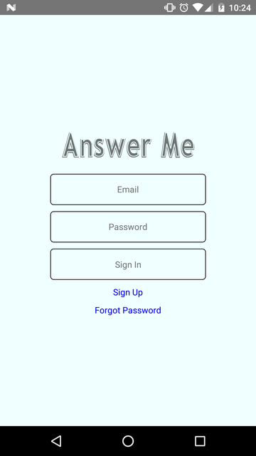
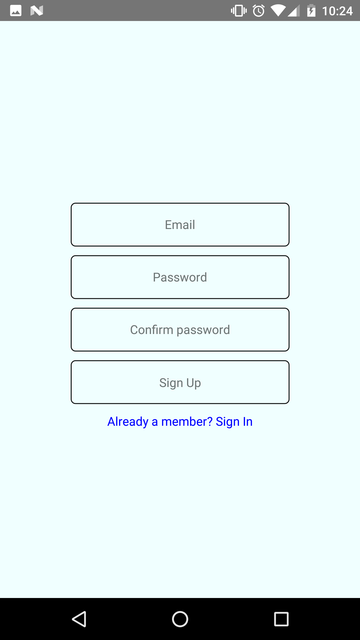
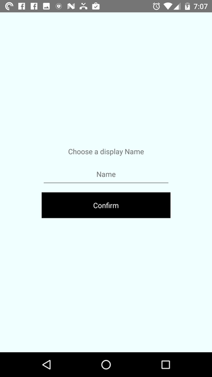
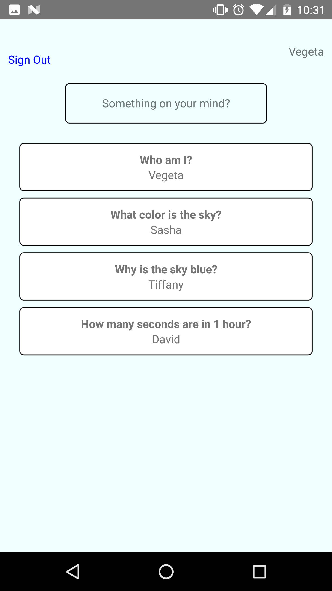
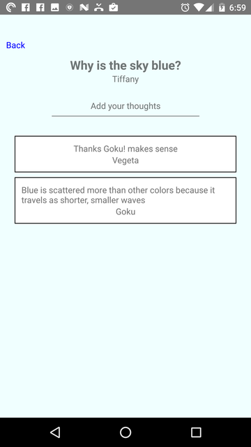
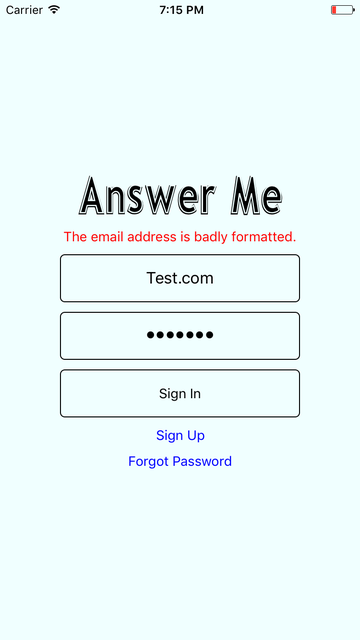
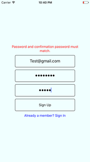

# React-Native-Answer-Me
A simple real-time QA app backed by Firebase. You will need to enter your own Firebase credentials to use the app. https://firebase.google.com/docs/web/setup

+ User Sign In / Sign Up with error validation
+ User Sign Out
+ Users can choose their own display name after signing up
+ Retreive list of topics/questions from Firebase backend in real time
+ Submit new topics/questions in real time
+ Any user can comment on existing topics/questions
+ Can easily reset your password via an email
+ Customized font using rnpm

